# Telegram Bot Farm — Mermaid Diagrams

Every diagram is a self-contained view. Read top-to-bottom: system → trigger → each action → detector → database.

---

## 1. System overview — three processes, one database

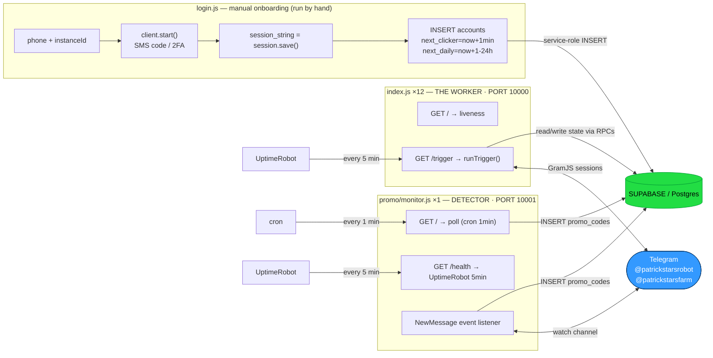

---

## 2. `/trigger` sweep — top-level control flow

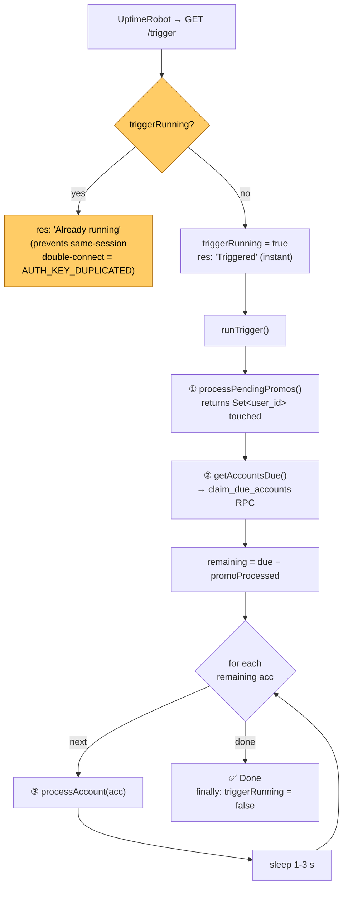

---

## 3. "Calling to due" — `getAccountsDue()` + `claim_due_accounts`

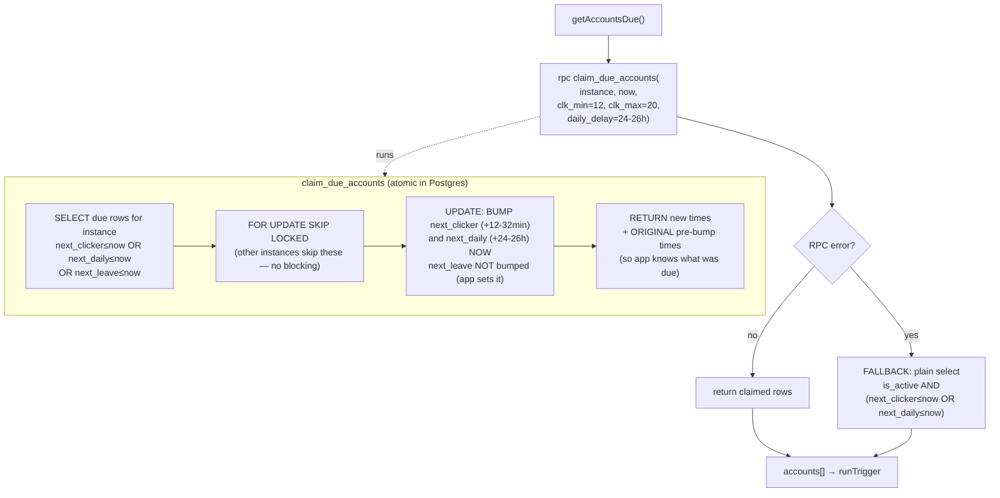

---

## 4. `processAccount(acc)` — per-account dispatch

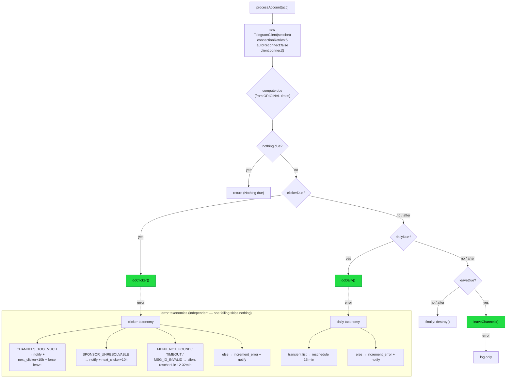

---

## 5. CLICKER — `doClicker()`

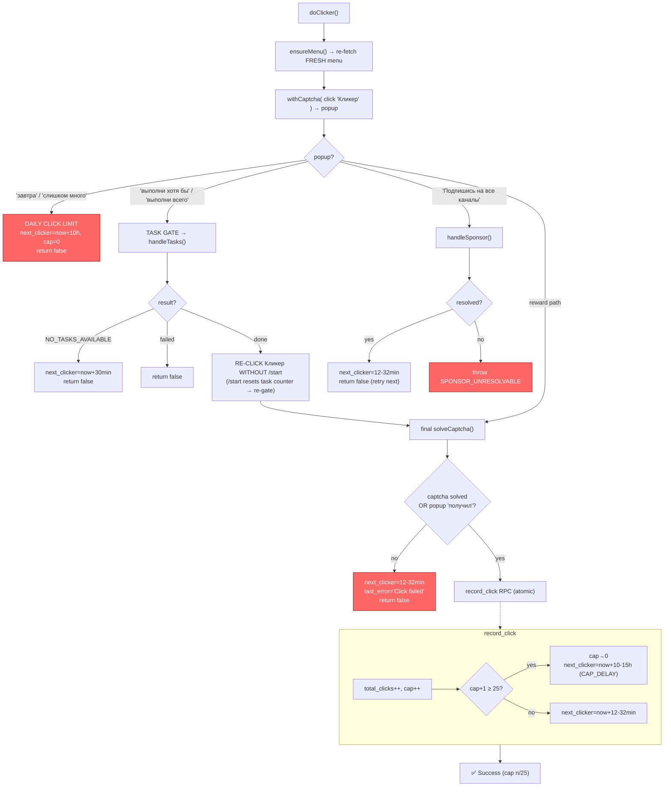

---

## 6. DAILY — `doDaily()`

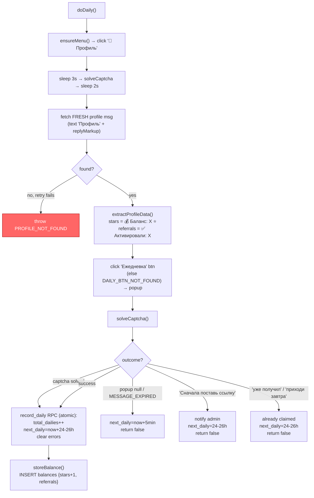

---

## 7. PROMO — `doPromo()` wrapper + `_doPromoAttempt()`

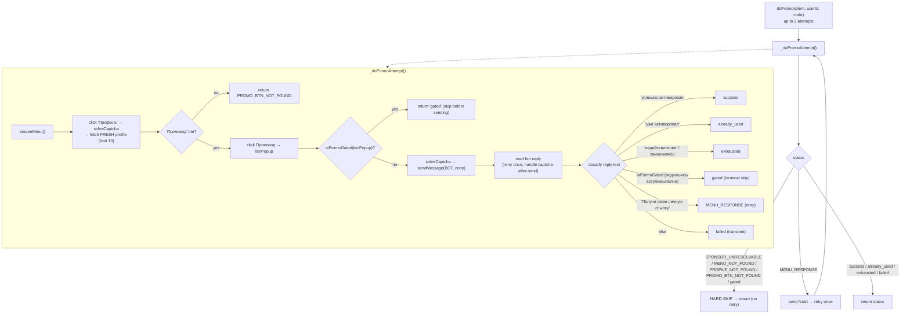

---

## 8. PROMO orchestration — `processPendingPromos()`

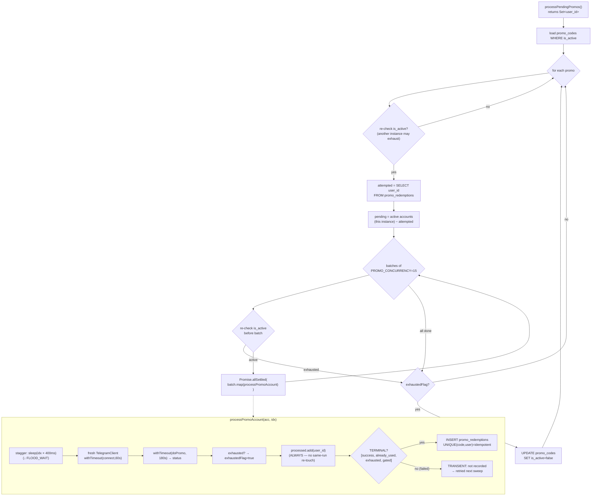

---

## 9. TASKS — `handleTasks()` (sub-flow of the clicker task-gate)

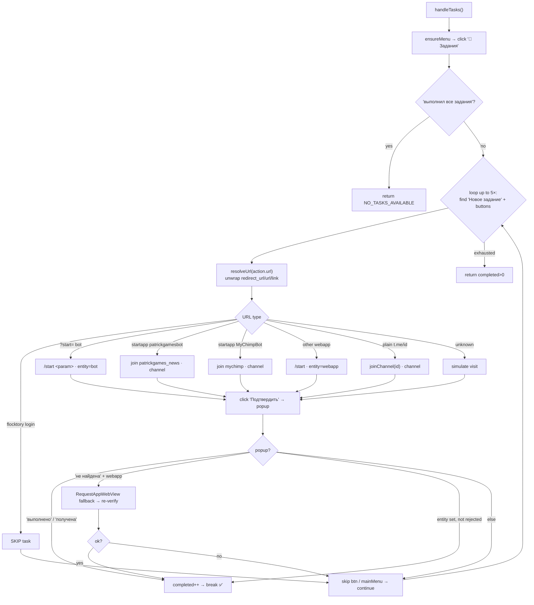

---

## 10. CAPTCHA & SPONSOR (cross-cutting helpers)

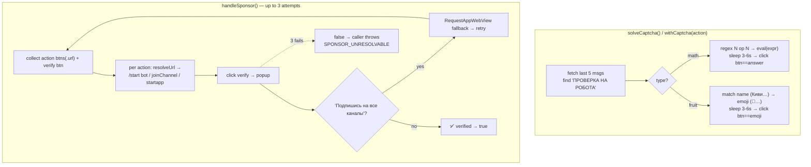

---

## 11. `leaveChannels()` — housekeeping (fail-closed)

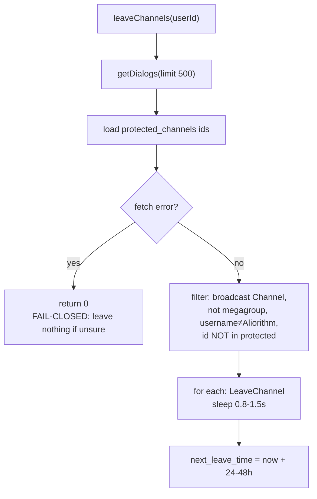

---

## 12. DETECTOR — `promo/monitor.js`

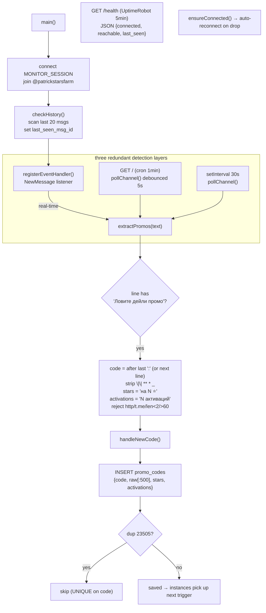

---

## 13. DATABASE — tables & the four atomic RPCs

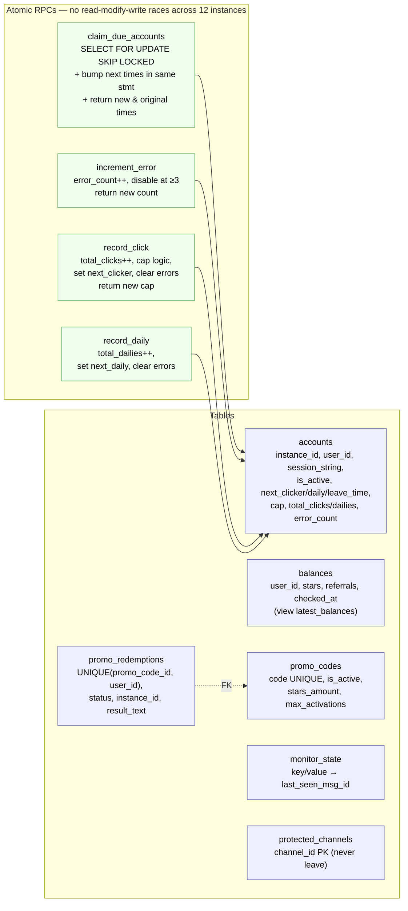

---

## 14. One full trigger — the lifeline (sequence)

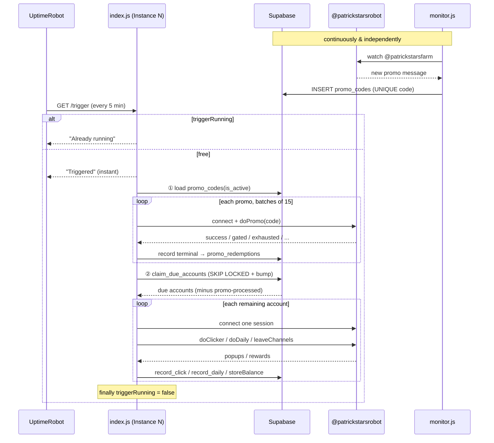
